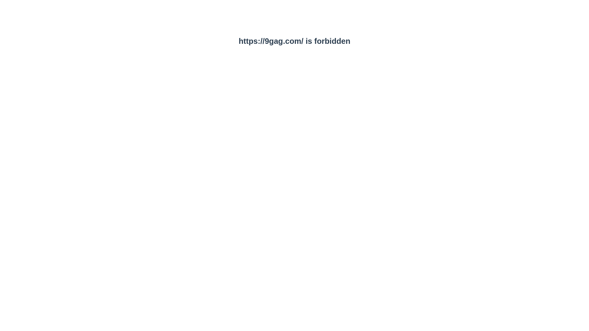

# productivityguard

> This extension block blacklisted sites

## Build Setup

``` bash
# install dependencies
npm install

# serve with hot reload at localhost:8080
npm run dev

# build for production with minification
npm run build

# build for production and view the bundle analyzer report
npm run build --report
```

## Chrome Extension Import

1. Open chrome://extensions/
2. Check developer mode
3. Click "Load unpacked extension"
4. Choose dist folder (after build setup steps)
5. Done!





For detailed explanation on how things work, checkout the [guide](http://vuejs-templates.github.io/webpack/) and [docs for vue-loader](http://vuejs.github.io/vue-loader).
